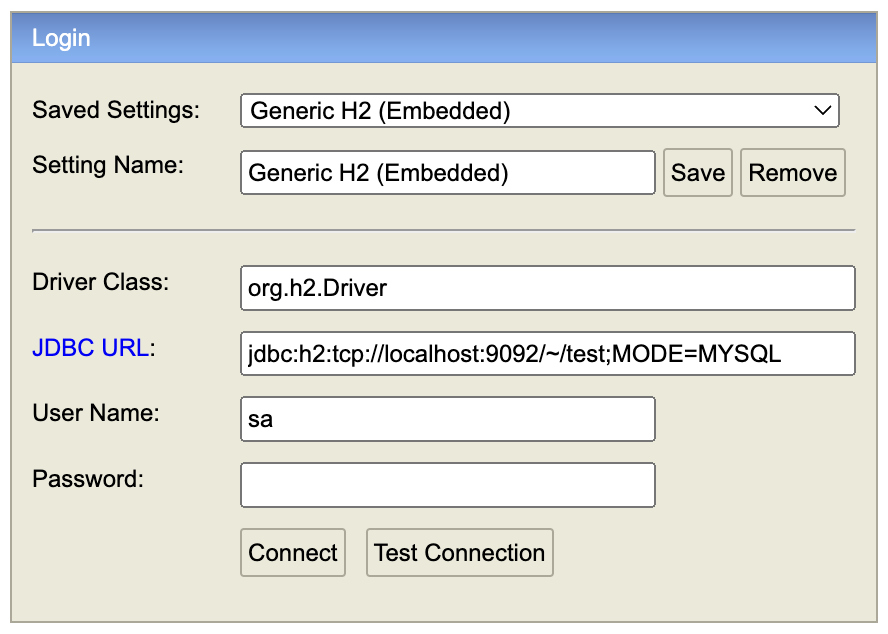

# 개요
무신사 Backend Engineer 과제
  
# 설명
프로젝트는 크게 3가지 모듈로 개발되었습니다.
- 판매자가 브랜드 및 상품을 등록, 추가, 삭제할 수 있는 shop-dashboard
- 구매자가 '코디 완성 서비스'를 이용할 수 있는 shop-style
- 카테고리, 브랜드 상품 도메인과 JPA 엔티티를 관리하는 shop-domain
  
'코디 완성 서비스'는 별도의 서버로 존재하여, 이용자가 많아지면 scale-out 하게 되지 않을까? 상상하며 별도의 모듈로 분리하게 되었고,  
카테고리의 경우 별도의 관리자용 운영툴에서 추가된다고 가정하고 개발을 진행하였습니다.  
  
브랜드의 카테고리에는 1개의 상품은 존재하고, 상품 품절은 없다고 가정한 부분을 참고하여 로직을 구성하였으나,  
상품의 가격이 동일한 경우에 대해서는 임의로 브랜드의 이름이 사전 순으로 뒤쪽에 존재할 때 우선순위를 갖도록 하였습니다.
  
# 빌드 방법
- `./gradlew assemble`
  
# 실행 방법
```sh
java -jar ./shop-dashboard/build/libs/shop-dashboard-0.0.1-SNAPSHOT.jar --spring.profiles.active=local
```
```sh
java -jar ./shop-style/build/libs/shop-style-0.0.1-SNAPSHOT.jar --spring.profiles.active=local
```
  
# 테스트 방법
- `./gradlew test`
  - build/reports/tests/test/index.html 파일을 브라우저에서 열어 테스트 결과를 확인할 수 있습니다.
- `./gradlew jacocoTestReport`
  - build/reports/jacoco/test/html/index.html 파일을 브라우저에서 열어 커버리지 결과를 확인할 수 있습니다.
  
### h2 안내
- h2 실행이 필요합니다.
  - h2.sh에 권한 주고 실행
```sh
cd h2/bin
chmod 755 h2.sh
./h2.sh
```
  
  - 최초에는 데이터베이스 파일을 만들어주세요!
    - jdbc:h2:~/test 작성 후 'Connect'
    - ~/test.mv.db 파일 생성 확인
  - style-dashboard 실행 후
    - http://localhost:8080/h2-console 접속
    - jdbc:h2:tcp://localhost:9092/~/test;MODE=MYSQL
  - 
  
### 프로파일 안내
- shop-dashboard을 local 프로파일로 실행 시, 테이블 생성 및 더미 데이터가 삽입됩니다.
  - 따라서 local 프로파일을 반드시 설정해주시고, shop-dashboard 👉 shop-style 순서로 실행해주세요!
  
### API 문서 안내
- 스웨거를 통한 API 테스트가 가능합니다.
  - shop-dashboard: http://localhost:8080/swagger-ui/index.html
  - shop-style: http://localhost:8081/swagger-ui/index.html
  
# 기술 스택
- 언어
  - Java 17
- 프레임워크 및 라이브러리
  - Spring Boot 3
  - Spring Data JPA
  - JUnit 5
  - Swagger
- Database
  - H2
- Etc
  - Gradle
  
## API 목록
**shop-dashboard**

HTTP 메서드 | URI | 설명
-- | -- | --
GET | /api/v1/products/{productId} | 특정 상품 조회
GET | /api/v1/products?brandAlias={brandAlias} | 브랜드에 속한 상품 조회 ex) branda
GET | /api/v1/products?categoryCode={categoryCode} | 카테고리에 속한 상품 조회 ex) 001
POST | /api/v1/products | 상품 추가
PUT | /api/v1/products | 상품 수정
DELETE | /api/v1/products/{productId} | 상품 삭제
GET | /api/v1/brands | 모든 브랜드 조회
GET | /api/v1/brands/{brandId} | 특정 브랜드 조회
POST | /api/v1/brands | 브랜드 추가
PUT | /api/v1/brands | 브랜드 수정
DELETE | /api/v1/brands/{brandId} | 브랜드 삭제
  
**shop-style**

HTTP 메서드 | URI | 설명
-- | -- | --
GET | /api/v1/styles/categories | 모든 카테고리 가져오기
GET | /api/v1/styles/lowest-price-category | 카테고리 별 최저자격 브랜드와 상품 가격, 총액을 조회
GET | /api/v1/styles/lowest-total-price-brand | 단일 브랜드로 모든 카테고리 상품을 구매할 때 최저가격에 판매하는 브랜드와 카테고리의 상품가격, 총액을 조회
GET | /api/v1/styles/categories/categoryCode={categoryCode} | 카테고리 이름으로 최저, 최고 가격 브랜드와 상품 가격을 조회 (001 ~ 008)
  
## 테이블 구조
**brand 테이블**

id | alias | name | created_at | updated_at
-- | -- | -- | -- | --
1 | branda | A | 2024-07-20 23:33:42.391384+09 | 2024-07-20 23:33:42.391384+09
2 | brandb | B | 2024-07-20 23:33:42.412565+09 | 2024-07-20 23:33:42.412565+09
3 | brandc | C | 2024-07-20 23:33:42.413207+09 | 2024-07-20 23:33:42.413207+09
4 | brandd | D | 2024-07-20 23:33:42.413685+09 | 2024-07-20 23:33:42.413685+09
5 | brande | E | 2024-07-20 23:33:42.414142+09 | 2024-07-20 23:33:42.414142+09
6 | brandf | F | 2024-07-20 23:33:42.414587+09 | 2024-07-20 23:33:42.414587+09
7 | brandg | G | 2024-07-20 23:33:42.415025+09 | 2024-07-20 23:33:42.415025+09
8 | brandh | H | 2024-07-20 23:33:42.415449+09 | 2024-07-20 23:33:42.415449+09
8 | brandI | I | 2024-07-20 23:33:42.415449+09 | 2024-07-20 23:33:42.415449+09
  
**category 테이블**

id | code
-- | --
1 | 001
2 | 002
3 | 003
4 | 004
5 | 005
6 | 006
7 | 007
8 | 008
  
**product 테이블**

id | brand_id | category_code | name | price | updated_at | created_at
-- | -- | -- | -- | -- | -- | --
41 | 1 | 001 | 브랜드 A의 제품 1 | 11200 | 2024-07-20 23:33:42.517335+09 | 2024-07-20 23:33:42.517335+09
42 | 1 | 002 | 브랜드 A의 제품 2 | 5500 | 2024-07-20 23:33:42.518269+09 | 2024-07-20 23:33:42.518269+09
43 | 1 | 003 | 브랜드 A의 제품 3 | 4200 | 2024-07-20 23:33:42.51916+09 | 2024-07-20 23:33:42.51916+09
44 | 1 | 004 | 브랜드 A의 제품 4 | 9000 | 2024-07-20 23:33:42.52002+09 | 2024-07-20 23:33:42.52002+09
45 | 1 | 005 | 브랜드 A의 제품 5 | 2000 | 2024-07-20 23:33:42.520864+09 | 2024-07-20 23:33:42.520864+09
46 | 1 | 006 | 브랜드 A의 제품 6 | 1700 | 2024-07-20 23:33:42.521806+09 | 2024-07-20 23:33:42.521806+09
47 | 1 | 007 | 브랜드 A의 제품 7 | 1800 | 2024-07-20 23:33:42.522691+09 | 2024-07-20 23:33:42.522691+09
48 | 1 | 008 | 브랜드 A의 제품 8 | 2300 | 2024-07-20 23:33:42.523535+09 | 2024-07-20 23:33:42.523535+09
33 | 2 | 001 | 브랜드 B의 제품 1 | 10500 | 2024-07-20 23:33:42.509803+09 | 2024-07-20 23:33:42.509803+09
34 | 2 | 002 | 브랜드 B의 제품 2 | 5900 | 2024-07-20 23:33:42.510736+09 | 2024-07-20 23:33:42.510736+09
35 | 2 | 003 | 브랜드 B의 제품 3 | 3800 | 2024-07-20 23:33:42.511644+09 | 2024-07-20 23:33:42.511644+09
36 | 2 | 004 | 브랜드 B의 제품 4 | 9100 | 2024-07-20 23:33:42.512551+09 | 2024-07-20 23:33:42.512551+09
37 | 2 | 005 | 브랜드 B의 제품 5 | 2100 | 2024-07-20 23:33:42.513409+09 | 2024-07-20 23:33:42.513409+09
38 | 2 | 006 | 브랜드 B의 제품 6 | 2000 | 2024-07-20 23:33:42.514273+09 | 2024-07-20 23:33:42.514273+09
39 | 2 | 007 | 브랜드 B의 제품 7 | 2000 | 2024-07-20 23:33:42.515141+09 | 2024-07-20 23:33:42.515141+09
40 | 2 | 008 | 브랜드 B의 제품 8 | 2200 | 2024-07-20 23:33:42.516013+09 | 2024-07-20 23:33:42.516013+09
(...이하 생략...)
  
# 참고
## shop-style
### GET `localhost:8081/api/v1/styles/lowest-price-category`
<details>
  <summary>구현 1</summary>

#### 요청값
없음

#### 응답값
```json
{
    "제품": [
        {
            "카테고리": "상의",
            "브랜드": "C",
            "가격": "10,000"
        },
        {
            "카테고리": "아우터",
            "브랜드": "E",
            "가격": "5,000"
        },
        {
            "카테고리": "바지",
            "브랜드": "D",
            "가격": "3,000"
        },
        {
            "카테고리": "스니커즈",
            "브랜드": "G",
            "가격": "9,000"
        },
        {
            "카테고리": "가방",
            "브랜드": "A",
            "가격": "2,000"
        },
        {
            "카테고리": "모자",
            "브랜드": "D",
            "가격": "1,500"
        },
        {
            "카테고리": "양말",
            "브랜드": "I",
            "가격": "1,700"
        },
        {
            "카테고리": "악세서리",
            "브랜드": "F",
            "가격": "1,900"
        }
    ],
    "총액": "34,100"
}
```
</details>

### GET `localhost:8081/api/v1/styles/lowest-total-price-brand`
<details>
  <summary>구현 2</summary>

#### 요청값
없음

#### 응답값
```json
{
    "최저가": {
        "브랜드": "D",
        "카테고리": [
            {
                "카테고리": "상의",
                "가격": "10,100"
            },
            {
                "카테고리": "아우터",
                "가격": "5,100"
            },
            {
                "카테고리": "바지",
                "가격": "3,000"
            },
            {
                "카테고리": "스니커즈",
                "가격": "9,500"
            },
            {
                "카테고리": "가방",
                "가격": "2,500"
            },
            {
                "카테고리": "모자",
                "가격": "1,500"
            },
            {
                "카테고리": "양말",
                "가격": "2,400"
            },
            {
                "카테고리": "악세서리",
                "가격": "2,000"
            }
        ],
        "총액": "36,100"
    }
}
```
</details>

### GET `localhost:8081/api/v1/styles/categories/categoryCode=001`
<details>
  <summary>구현 3</summary>

#### 요청값
카테고리명(001, 002, ..., 008)

#### 응답값
```json
{
    "카테고리": "상의",
    "최저가": [
        {
            "브랜드": "C",
            "가격": "10,000"
        }
    ],
    "최고가": [
        {
            "브랜드": "I",
            "가격": "11,400"
        }
    ]
}
```
</details>
  
## shop-dashboard
### POST `localhost:8080/api/v1/brands`
<details>
  <summary>구현 3 - 브랜드 추가</summary>

#### 요청값
```json
{
    "alias": "progfrog",
    "name": "프로그의 옷가게"
}
```

#### 응답값
```json
{
    "isSuccess": true,
    "data": {
        "id": 10,
        "alias": "progfrog",
        "name": "프로그의 옷가게"
    }
}
```
</details>

### PUT `localhost:8080/api/v1/brands`
<details>
  <summary>구현 3 - 브랜드 수정</summary>

#### 요청값
```json
{
    "id": 10,
    "alias": "progfrog2",
    "name": "프로그의 옷가게 2"
}
```

#### 응답값
```json
{
    "isSuccess": true,
    "data": {
        "id": 10,
        "alias": "progfrog2",
        "name": "프로그의 옷가게 2"
    }
}
```
</details>

### DELETE `localhost:8080/api/v1/brands/10`
<details>
  <summary>구현 3 - 브랜드 삭제</summary>

#### 요청값
삭제할 브랜드의 ID

#### 응답값
Http Status OK

</details>

### POST `localhost:8080/api/v1/products`
<details>
  <summary>구현 3 - 제품 추가</summary>

#### 요청값
```json
{
    "brandId": 1,
    "categoryCodeKey": "001",
    "name": "프로그의 바지1",
    "price": 11111
}
```

#### 응답값
```json
{
    "isSuccess": true,
    "data": {
        "id": 73,
        "brand": {
            "id": 1,
            "alias": "branda",
            "name": "A"
        },
        "category": {
            "key": "001",
            "value": "상의"
        },
        "name": "프로그의 바지1",
        "price": 11111
    }
}
```
</details>

### PUT `localhost:8080/api/v1/products`
<details>
  <summary>구현 3 - 제품 수정</summary>

#### 요청값
```json
{
    "id":73,
    "brandId": 3,
    "categoryCodeKey": "002",
    "name": "프로그의 바지2",
    "price": 99999
}
```

#### 응답값
```json
{
    "isSuccess": true,
    "data": {
        "id": 73,
        "brand": {
            "id": 3,
            "alias": "brandc",
            "name": "C"
        },
        "category": {
            "key": "002",
            "value": "아우터"
        },
        "name": "프로그의 바지2",
        "price": 99999
    }
}
```
</details>

### DELETE `localhost:8080/api/v1/products/1`
<details>
  <summary>구현 3 - 제품 삭제</summary>

#### 요청값
삭제할 제품의 ID

#### 응답값
Http Status OK
</details>
